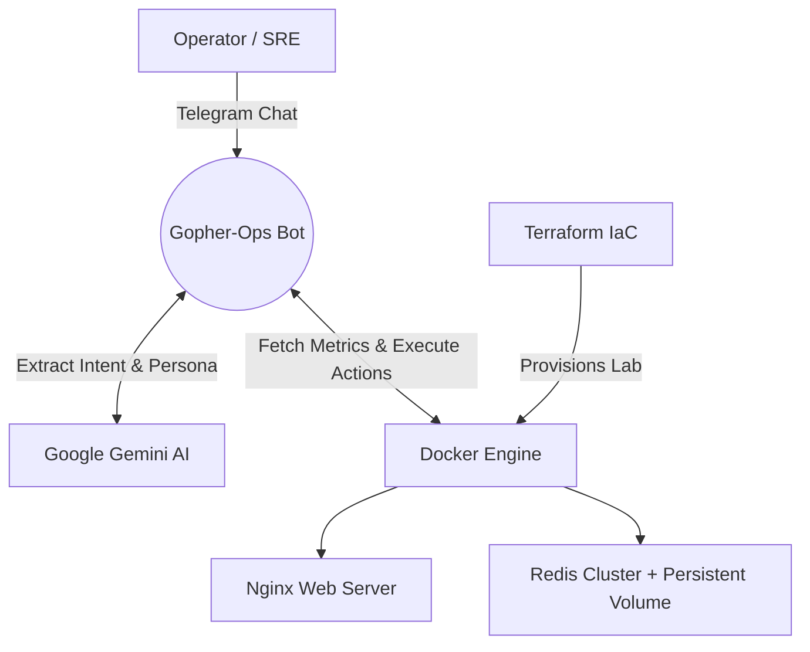

# 🤖 Gopher-Ops: AI-Driven SRE ChatOps Platform


An AI-driven Site Reliability Engineering (SRE) bot powered by **Google Gemini** and **Telegram**. Gopher-Ops monitors your host system metrics (CPU, RAM) and allows you to perform basic triage and healing actions (start, stop, restart containers, clear cache) via a Telegram chat interface. 

Designed with modern DevOps principles, it features **Infrastructure as Code (IaC)** provisioning via Terraform and automated CI/CD pipelines.

---

## 🚀 Key Features (Portfolio Highlights)

- **Infrastructure as Code (IaC):** Automated provisioning of a containerized lab environment (Nginx & stateful Redis cluster) using **Terraform**, complete with Custom Networks, Persistent Volumes, Variables, and Count loops for scaling.
- **System Observability & SRE:** Developed in **Golang**, the bot fetches real-time host metrics (CPU/RAM) and container statuses directly via the Docker API.
- **Generative AI ChatOps:** Integrated **Google Gemini (2.5-flash-lite)** to act as an intent parser. It understands natural language logs and triggers technical SRE actions in a casual "Gen-Z" persona to reduce operator cognitive load.
- **Interactive Healing Actions:** Parses AI intents to generate Human-in-the-loop (HITL) inline Telegram buttons, allowing the operator to start, stop, restart, or clear cache directly from chat.
- **Robust CI/CD Pipeline:** Configured with **GitHub Actions** for automated Go unit testing and Terraform validation/formatting upon every push/PR.
- **Zero-Trust Security:** Hardcoded Telegram Chat ID gating ensuring only the authorized operator can view metrics or execute system-level docker commands.

## 🏗️ Architecture Workflow



## 🛠️ Tech Stack

- **Backend:** Go (Golang), Docker API SDK, gopsutil
- **AI / NLP:** Google Generative AI (Gemini Flash-Lite)
- **Infrastructure:** Docker, Terraform (HCL)
- **CI/CD:** GitHub Actions
- **Interface:** Telegram Bot API

## 📋 Prerequisites

- [Go 1.22+](https://go.dev/)
- [Docker](https://www.docker.com/) running on the host machine.
- [Terraform](https://developer.hashicorp.com/terraform/downloads) CLI installed.
- A Telegram Bot Token (from [@BotFather](https://t.me/BotFather)).
- A Google Gemini API Key.

## ⚙️ Setup & Deployment

### 1. Configure the AI Bot (Go)

Clone the repository and set up your credentials:
```bash
git clone https://github.com/yourusername/gopher-ops.git
cd gopher-ops
cp .env.example .env
go mod tidy
```
**Important:** Update `.env` with your Gemini API key, Telegram Token, and your specific `AUTHORIZED_CHAT_ID`.

### 2. Provision the Target Lab (Terraform)

Deploy the dummy microservices (Nginx & Redis) for the bot to monitor:
```bash
cd terraform
terraform init
terraform apply -auto-approve
```
*This will spin up `gopher-ops-nginx-lab` and scaled Redis nodes with persistent data volumes on a custom docker network.*

### 3. Run Gopher-Ops

Return to the root directory and boot up the SRE agent:
```bash
cd ..
go run cmd/main.go
```

## 🎮 ChatOps Usage

Once the bot is running, simply PM it on Telegram to start managing your infrastructure:
- *"Bro, check system health jap"* -> Bot reads live CPU/RAM and lists the Terraform-provisioned containers.
- *"Tolong stop container gopher-ops-nginx-lab"* -> Bot understands the intent, verifies state, and provides a clickable inline `🛑 Stop` button.
- *"Minta restart redis satu"* -> Re-initializes specific containers directly across the Docker daemon.

## ⚠️ Disclaimer
This project binds to the host's Docker socket to execute real container lifecycles. Please ensure your `AUTHORIZED_CHAT_ID` is strictly configured to prevent unauthorized infrastructure manipulation.
