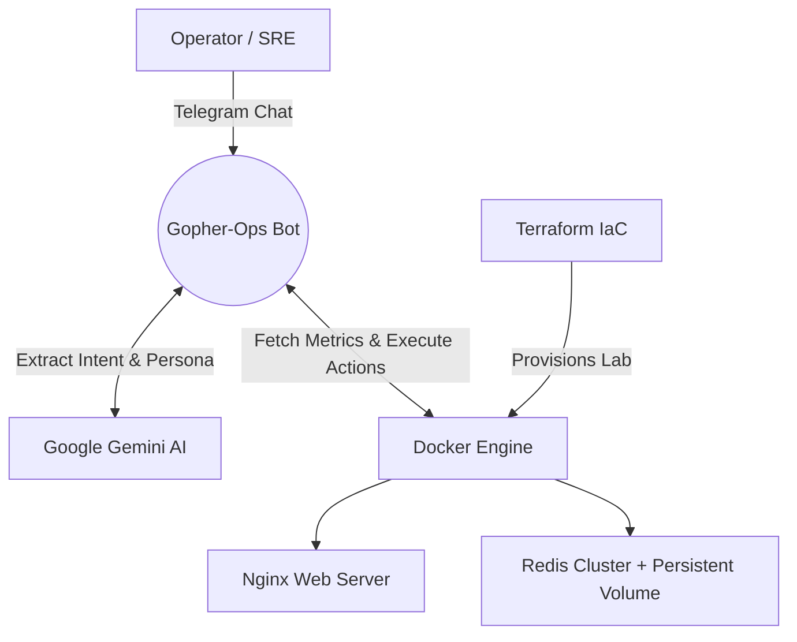

# 🤖 Gopher-Ops: AI-Driven SRE ChatOps Platform


**Gopher-Ops** is a Secure AI SRE Telegram bot managing Docker, Kubernetes, and system metrics via natural language.

## 🚀 Key Features

- **AI ChatOps:** Powered by **Google Gemini (2.0/2.5-flash)** to parse intents and logs, answering infrastructure queries in a casual persona to reduce operator cognitive load.
- **Telemetry & Observability:** Real-time monitoring of host OS (CPU/RAM), Docker, and Kubernetes states via **gopsutil**, **Docker SDK**, and **MCP**. Includes a 1-hour in-memory metric history for sustained high-load detection and proactive alerting.
- **Guided Triage & HITL Execution:** Parses AI suggestions into clickable Telegram buttons for safe actions (Start/Stop/Restart) and interactive troubleshooting flows (Network triage & Configuration validation).
- **Infrastructure as Code (IaC):** **Terraform** provisions a local microservices lab environment (Nginx, scalable/stateful Redis cluster, custom networks, and persistent volumes).
- **Sec & Ops:** Zero-Trust ID gating via Telegram; Automated Docker image vulnerability scanning; and a robust **GitHub Actions** CI/CD pipeline for Go tests and Terraform validation.
- **Kubernetes & MCP Support:** Seamlessly manages cluster operations using the **Model Context Protocol (MCP)**, bridging AI with Kubernetes native tools.
- **Robust CI/CD Pipeline:** Configured with **GitHub Actions** for automated Go unit testing and Terraform validation/formatting upon every push/PR.
- **Zero-Trust & DevSecOps:** Hardcoded Telegram Chat ID gating ensuring only the authorized operator can execute commands. Includes **automated image vulnerability scanning** for outdated Docker tags/CVEs.

## 🎮 Interactive Demo

> **Self-Healing in Action:** Watch Gopher-Ops detect a crashed Redis node, analyze the root cause (RCA) via Gemini AI, and perform an automated restart.


*(Sila namakan video kau `demo.mp4` and letak dalam folder `assets/`!)*


## 🏗️ Architecture Workflow



## 🛠️ Tech Stack

- **Backend:** Go (Golang), Docker API SDK, gopsutil, **MCP Go SDK**
- **AI / NLP:** Google Generative AI (Gemini 2.0 Flash)
- **Infrastructure:** Docker, Kubernetes, Terraform (HCL), **MCP Server Kubernetes**
- **CI/CD:** GitHub Actions
- **Interface:** Telegram Bot API

## 📋 Prerequisites

- [Go 1.22+](https://go.dev/)
- [Docker](https://www.docker.com/) running on the host machine.
- [Terraform](https://developer.hashicorp.com/terraform/downloads) CLI installed.
- A Telegram Bot Token (from [@BotFather](https://t.me/BotFather)).
- A Google Gemini API Key.

## ⚙️ Setup & Deployment

### 1. Configure the AI Bot (Go)

Clone the repository and set up your credentials:
```bash
git clone https://github.com/yourusername/gopher-ops.git
cd gopher-ops
cp .env.example .env
go mod tidy
```
**Important:** Update `.env` with your Gemini API key, Telegram Token, and your specific `AUTHORIZED_CHAT_ID`.

### 2. Provision the Target Lab (Terraform)

Deploy the dummy microservices (Nginx & Redis) for the bot to monitor:
```bash
cd terraform
terraform init
terraform apply -auto-approve
```
*This will spin up `gopher-ops-nginx-lab` and scaled Redis nodes with persistent data volumes on a custom docker network.*

### 3. Run Gopher-Ops

Return to the root directory and boot up the SRE agent:
```bash
cd ..
go run cmd/main.go
```

## 🎮 ChatOps Usage

Once the bot is running, simply PM it on Telegram to start managing your infrastructure:
- *"Bro, check system health jap"* -> Bot reads live CPU/RAM and lists the Terraform-provisioned containers.
- *"List pods dalam cluster k8s aku"* -> Bot uses MCP to fetch real-time pod data from Kubernetes.
- *"Kenapa pod database asyik restart?"* -> Bot triggers an automated `k8s-diagnose` workflow to find the root cause.

## 📁 Project Structure

```text
.
├── cmd/
│   └── main.go           # Bot entry point & Telegram handler
├── pkg/
│   ├── actions/          # Docker & Terraform execution logic
│   ├── ai/               # Gemini AI integration & prompt engineering
│   ├── mcp/              # Model Context Protocol (K8s) manager
│   └── monitor/          # System metrics & container tracking
├── terraform/            # IaC for the microservices lab
├── .github/workflows/    # CI/CD (Go tests & TF validation)
├── demo-k8s.yaml         # Sample K8s manifest
└── README.md             # You are here!
```

## 🗺️ Roadmap

- [ ] **Multi-Cloud Support:** Integration with AWS/GCP metrics.
- [ ] **Custom Personas:** Switch between "Chill Dev" and "Strict SRE" tones.
- [ ] **Visual RCA:** Generate graphs for log patterns using AI.
- [ ] **Voice Commands:** Support for Telegram Voice Notes.

## 🤝 Contributing

Contributions are welcome! Whether it's fixing a bug, adding a new tool, or improving the documentation:
1. Fork the Project.
2. Create your Feature Branch (`git checkout -b feature/AmazingFeature`).
3. Commit your Changes (`git commit -m 'Add some AmazingFeature'`).
4. Push to the Branch (`git push origin feature/AmazingFeature`).
5. Open a Pull Request.


## 📜 Credits & Acknowledgments

The Kubernetes management capabilities of Gopher-Ops are powered by the **Model Context Protocol (MCP)** and the excellent [MCP Server Kubernetes](https://github.com/Flux159/mcp-server-kubernetes) community project. Special thanks to the authors for their work in bridging AI and Kubernetes.

## ⚠️ Disclaimer
This project binds to the host's Docker socket and Kubernetes API to execute real infrastructure lifecycles. Please ensure your `AUTHORIZED_CHAT_ID` is strictly configured to prevent unauthorized manipulation.

## 📄 License
This project is licensed under the **MIT License**. See the [LICENSE](LICENSE) file for more details.

